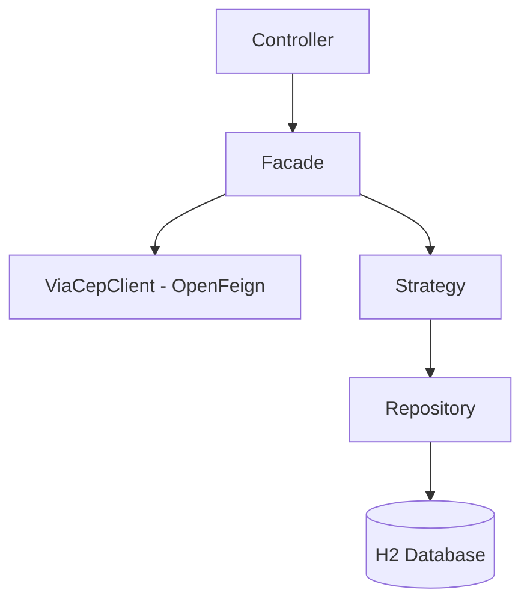
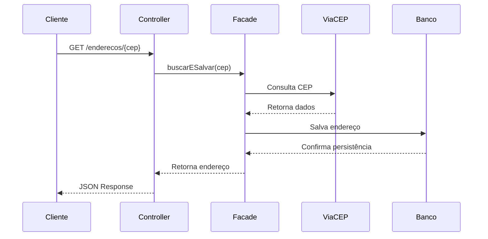
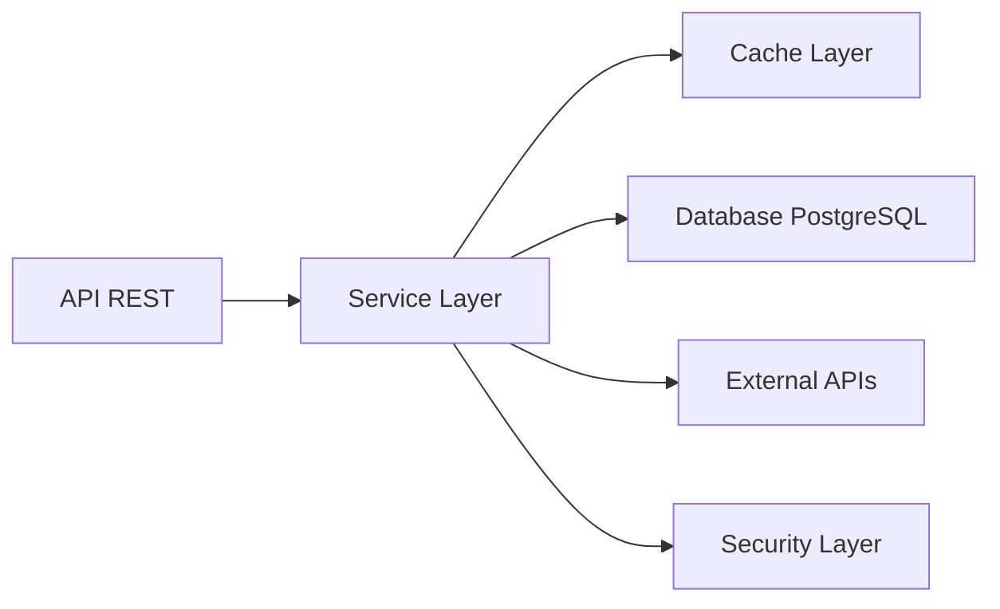

# 📌 Cliente CEP API

API REST desenvolvida com Spring Boot para consumo do WebService ViaCEP, persistindo dados em banco H2 e aplicando padrões de projeto (Singleton, Strategy e Facade).

## 🚀 Tecnologias Utilizadas

- **Java 21**
- **Spring Boot 3.3.x**
- **Spring Web**
- **Spring Data JPA**
- **H2 Database**
- **OpenFeign**
- **OpenAPI / Swagger**
- **Maven**

## 🧠 Padrões de Projeto Aplicados

### ✔ Singleton

Os serviços são gerenciados pelo container do Spring como Singleton por padrão.

### ✔ Strategy

Permite definir diferentes estratégias para salvar ou manipular endereços sem alterar a lógica principal.

### ✔ Facade

A classe `EnderecoFacade` simplifica o fluxo entre Controller, Feign Client e Strategy.

## 📂 Estrutura do Projeto



## 🔄 Fluxo da Aplicação



## 🌐 Endpoint Disponível

### Buscar e salvar endereço pelo CEP

```
GET /enderecos/{cep}
```

**Exemplo:**
```
GET http://localhost:8080/enderecos/01001000
```

## 📖 Documentação Swagger

Após iniciar a aplicação:

```
http://localhost:8080/swagger-ui.html
```

## 🗄 Banco de Dados H2

Console disponível em:

```
http://localhost:8080/h2-console
```

**Configuração:**

- **JDBC URL:** `jdbc:h2:mem:testdb`
- **User:** `sa`
- **Password:** (vazio)

## ⚙️ Como Executar o Projeto

```bash
git clone <repositorio>
cd cliente-cep-api
mvn spring-boot:run
```

Ou executar pela IDE.

## 📌 Exemplo de Resposta

```json
{
  "cep": "01001-000",
  "logradouro": "Praça da Sé",
  "bairro": "Sé",
  "localidade": "São Paulo",
  "uf": "SP",
  "ibge": "3550308",
  "ddd": "11"
}
```

## 🔮 Roadmap Futuro (Melhorias Planejadas)

Este projeto poderá evoluir para incluir:

### 🔐 Segurança
- Autenticação com Spring Security
- JWT
- Controle de acesso por roles

### 📦 Cache
- Cache com Redis
- Evitar chamadas repetidas ao ViaCEP

### 🗃 Banco Persistente
- Migração para PostgreSQL
- Versionamento com Flyway

### 📊 Monitoramento
- Spring Boot Actuator
- Logs estruturados
- Métricas com Prometheus

### 📄 Documentação Avançada
- Versionamento de API
- Padrão RESTful completo

### 🧪 Testes
- Testes unitários com JUnit
- Testes de integração
- Testcontainers

### 📚 Funcionalidades Extras
- Buscar todos os CEPs já consultados
- Deletar CEP salvo
- Atualizar endereço manualmente
- Filtro por cidade ou estado
- Paginação
- Histórico de consultas

## 🏗 Possível Evolução Arquitetural



## 🎯 Objetivo Acadêmico

Este projeto foi desenvolvido com foco em:

- Aplicação de padrões de projeto
- Integração com WebService externo
- Organização em camadas
- Boas práticas de arquitetura Spring

## 👨‍💻 Autor
- Davi Tavares
- Projeto desenvolvido para fins acadêmicos utilizando boas práticas de desenvolvimento backend com Spring Boot.
