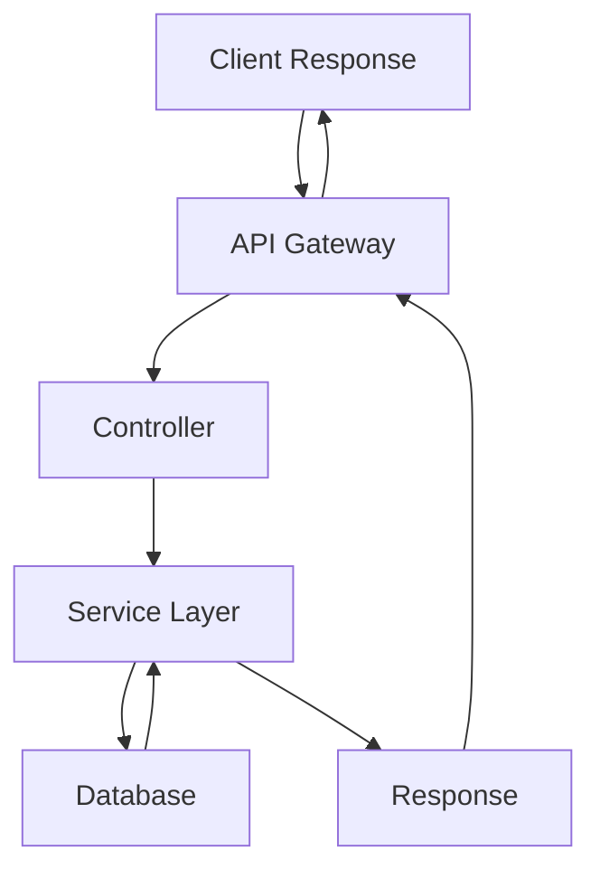

# Client CEP API

## Technology Stack
- **Backend**: Node.js, Express
- **Database**: MongoDB
- **Others**: Jest for testing, Docker for containerization

## Design Patterns
- MVC (Model-View-Controller)
- Repository Pattern
- Singleton Pattern

## Project Structure
```
- `/src`
  - `/controllers`
  - `/models`
  - `/routes`
  - `/middlewares`
  - `/config`
- `/tests`
- `Dockerfile`
- `README.md`
```

## Application Flow


## Endpoints
- **GET /api/cep/:cep**: Fetch address by CEP
- **POST /api/cep**: Create a new CEP entry
- **PUT /api/cep/:cep**: Update an existing CEP entry
- **DELETE /api/cep/:cep**: Delete a CEP entry

## Database Configuration
- MongoDB connection string:
  ```plaintext
  mongodb://localhost:27017/client-cep-api
  ```

## Execution Instructions
1. Clone the repository
   ```bash
   git clone https://github.com/bessa2121/client-cep-api.git
   ```
2. Navigate to the directory
   ```bash
   cd client-cep-api
   ```
3. Install dependencies
   ```bash
   npm install
   ```
4. Start the application
   ```bash
   npm start
   ```

## Response Examples
- **Successful Response**:
```json
{
  "cep": "12345-678",
  "address": "Some Address",
  "city": "Some City",
  "state": "Some State"
}
```

- **Error Response**:
```json
{
  "error": "CEP not found."
}
```

## Future Roadmap
- Implementation of caching for faster response times
- Adding more endpoints for comprehensive data handling
- Enhanced error handling
- Performance optimizations