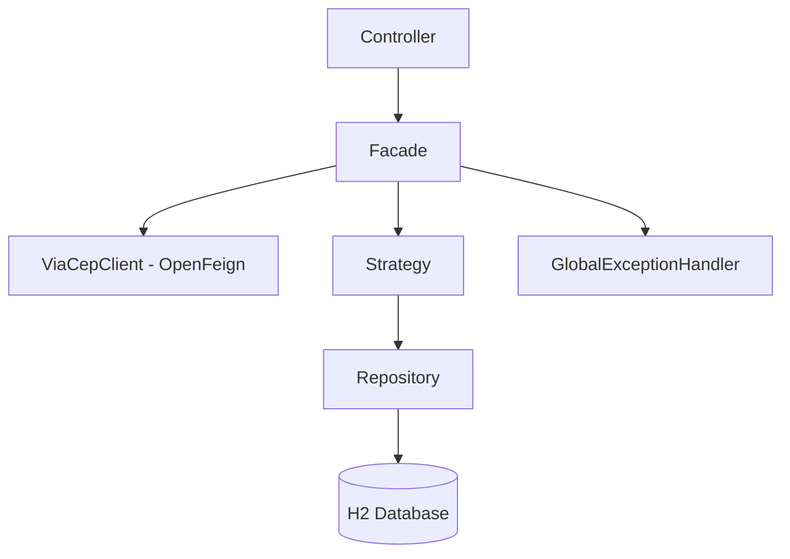

# 📌 Cliente CEP API

API REST desenvolvida com Spring Boot para consumo do WebService ViaCEP, persistindo dados em banco H2 e aplicando padrões de projeto (Singleton, Strategy e Facade). CRUD completo, com verbos HTTP corretos, códigos de status apropriados e tratamento de erros centralizado.

## 🚀 Tecnologias Utilizadas

- **Java 21**
- **Spring Boot 3.3.5**
- **Spring Web**
- **Spring Data JPA**
- **Bean Validation** (spring-boot-starter-validation)
- **H2 Database**
- **OpenFeign**
- **OpenAPI / Swagger**
- **Maven**

## 🧠 Padrões de Projeto Aplicados

### ✔ Singleton
Os serviços são gerenciados pelo container do Spring como Singleton por padrão.

### ✔ Strategy
`EnderecoStrategy` define o contrato de persistência (`salvar` / `atualizar`); `SalvarEnderecoStrategy` é a implementação atual, podendo ser trocada sem alterar o Facade.

### ✔ Facade
A classe `EnderecoFacade` concentra o fluxo entre Controller, Feign Client (ViaCEP), Strategy e Repository.

## 📂 Estrutura do Projeto


```mermaid
flowchart TD
    A[Controller] --> B[Facade]
    B --> C[ViaCepClient - OpenFeign]
    B --> D[Strategy]
    D --> E[Repository]
    E --> F[(H2 Database)]
    B --> G[GlobalExceptionHandler]
```

## 🌐 Endpoints Disponíveis (CRUD completo)

| Verbo  | Rota              | Descrição                                                   | Sucesso | Erros                        |
|--------|-------------------|---------------------------------------------------------------|---------|-------------------------------|
| POST   | `/enderecos/{cep}`| Consulta o ViaCEP e **cria** o endereço localmente            | 201     | 400, 404, 409, 503            |
| GET    | `/enderecos/{cep}`| Busca um endereço **já cadastrado** localmente (idempotente)  | 200     | 400, 404                      |
| GET    | `/enderecos`      | Lista todos os endereços cadastrados (paginado: `?page=&size=&sort=`) | 200 | -                        |
| PUT    | `/enderecos/{cep}`| Atualiza manualmente os dados de um endereço existente         | 200     | 400, 404                      |
| DELETE | `/enderecos/{cep}`| Remove um endereço cadastrado                                  | 204     | 400, 404                      |

> `GET` é seguro/idempotente e nunca grava dados — a criação (efeito colateral) só acontece via `POST`, seguindo a semântica HTTP correta.

**Exemplos:**
```
POST   http://localhost:8080/enderecos/01001000
GET    http://localhost:8080/enderecos/01001000
GET    http://localhost:8080/enderecos?page=0&size=10&sort=localidade
PUT    http://localhost:8080/enderecos/01001000
DELETE http://localhost:8080/enderecos/01001000
```

**Corpo para PUT:**
```json
{
  "logradouro": "Praça da Sé",
  "complemento": "lado ímpar",
  "bairro": "Sé",
  "localidade": "São Paulo",
  "uf": "SP",
  "ibge": "3550308",
  "ddd": "11"
}
```

**Resposta padrão (200/201):**
```json
{
  "cep": "01001000",
  "logradouro": "Praça da Sé",
  "bairro": "Sé",
  "localidade": "São Paulo",
  "uf": "SP",
  "ibge": "3550308",
  "ddd": "11",
  "criadoEm": "2026-09-17T10:00:00",
  "atualizadoEm": "2026-09-17T10:00:00"
}
```

**Resposta padrão de erro (ex.: 404):**
```json
{
  "timestamp": "2026-09-17T10:00:00",
  "status": 404,
  "error": "Not Found",
  "message": "Nenhum endereço cadastrado para o CEP 99999999",
  "path": "/enderecos/99999999"
}
```

## ⚠️ Tratamento de Erros

Centralizado em `GlobalExceptionHandler` (`@RestControllerAdvice`), mapeando cada exceção de domínio para o status HTTP correto:

- `CepInvalidoException` → **400** (formato de CEP inválido)
- `MethodArgumentNotValidException` → **400** (falha de validação no corpo do PUT, com lista de `details`)
- `RecursoNaoEncontradoException` → **404** (CEP não cadastrado localmente ou inexistente no ViaCEP)
- `EnderecoJaExisteException` → **409** (tentativa de `POST` para um CEP já cadastrado)
- `ViaCepIndisponivelException` → **503** (falha de comunicação com o ViaCEP)
- Qualquer outra exceção → **500**, sem vazar stacktrace para o cliente

## 📖 Documentação Swagger

```
http://localhost:8080/swagger-ui.html
```

## 🗄 Banco de Dados H2

```
http://localhost:8080/h2-console
```

- **JDBC URL:** `jdbc:h2:mem:testdb`
- **User:** `sa`
- **Password:** (vazio)

## ⚙️ Como Executar o Projeto

```bash
git clone <repositorio>
cd cliente-cep-api
mvn spring-boot:run
```

Ou executar pela IDE.

## 🧪 Testes

Testes de integração do Controller (`EnderecoControllerTest`, via `@WebMvcTest` + `MockMvc`) cobrindo os cinco endpoints e os principais cenários de erro (404, 400 de validação).

```bash
mvn test
```

## 🔮 Roadmap Futuro (Melhorias Planejadas)

- 🔐 Autenticação com Spring Security / JWT
- 📦 Cache com Redis (evitar chamadas repetidas ao ViaCEP)
- 🗃 Migração para PostgreSQL + Flyway
- 📊 Spring Boot Actuator, logs estruturados, métricas
- 🔗 HATEOAS (links de navegação nas respostas)
- 🔢 Versionamento de API (`/v1/...`)
- 🧪 Testcontainers para testes de integração com banco real

## 🎯 Objetivo Acadêmico

Projeto desenvolvido com foco em: aplicação de padrões de projeto, integração com WebService externo, organização em camadas, boas práticas de API RESTful (verbos e status HTTP corretos, DTOs desacoplados da entidade, tratamento de erros centralizado, validação de entrada).

## 👨‍💻 Autor
- Davi Tavares
- Projeto desenvolvido para fins acadêmicos utilizando boas práticas de desenvolvimento backend com Spring Boot.
